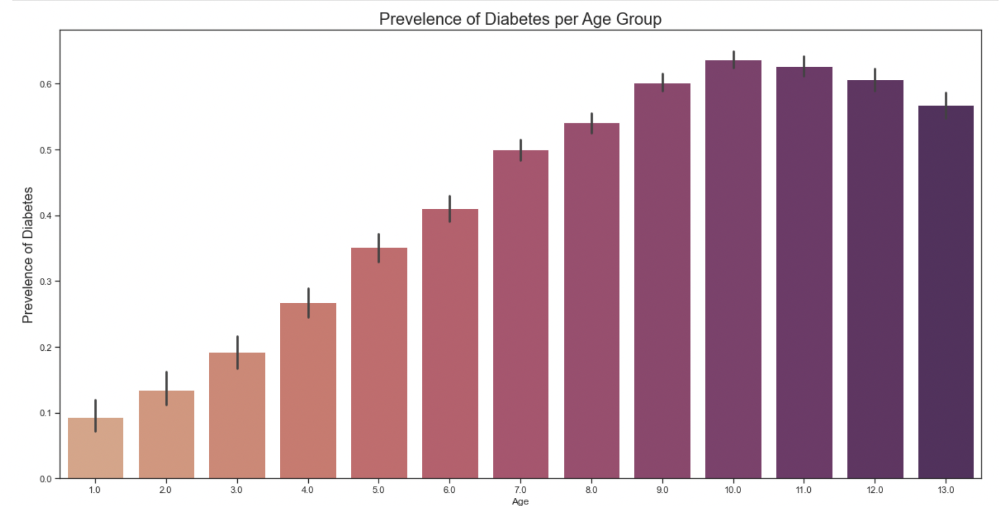
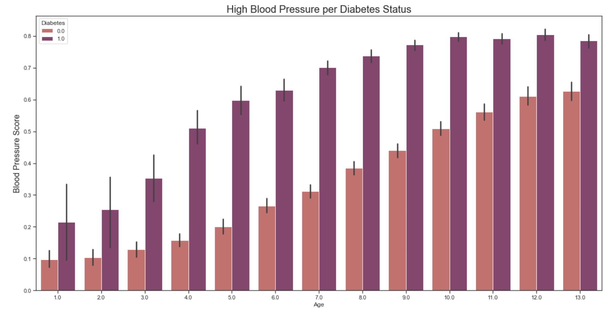
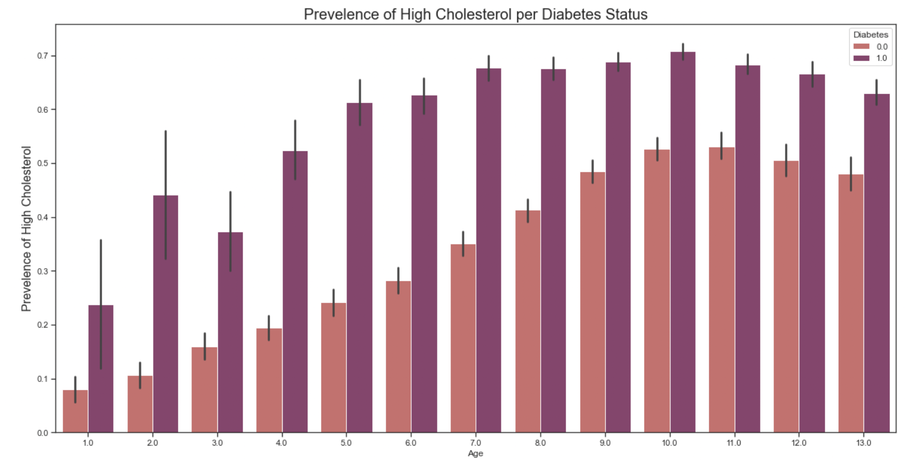
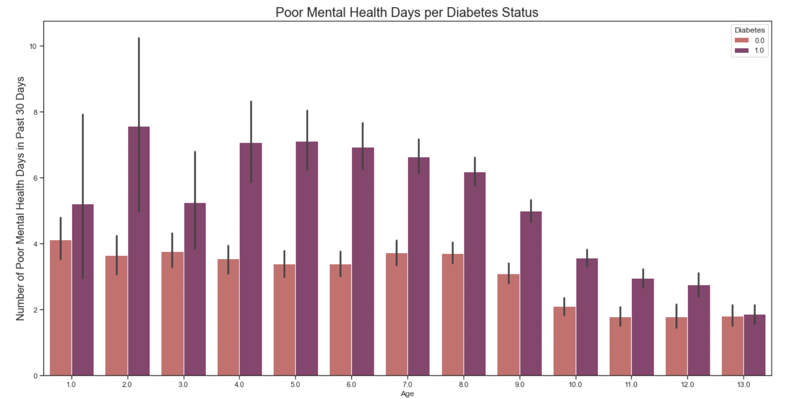
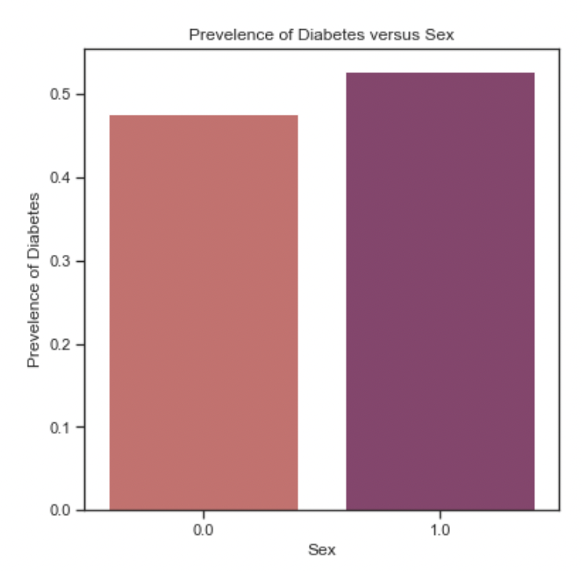

# Phase 3 Diabetes Screening

Welcome prospective doctors, nurses, and beyond! For my third phase project in the Flatiron Data Science program, I have made a model that can help screen patients for diabetes. 

In this project description, we will cover:

* [***Project Overview:***](#project-overview) The project goal, audience, and dataset
* [***Basic Walkthrough:***](#Walkthrough) The basics of what I did during the project
* [***Final Model***](#final_model) Final model chosen based on my target recall threshold
* [***Findings:***](#findings) Important features and recommendations based on those
* [***Business Recommendations:***](#busrec) Important features and recommendations based on those
* [***What's Next:***](#next) What I'd like to do to improve further

## Project Overview

For this project, I used exploratory data analysis, data preparation, and modeling to generate insights for a business stakeholder.

### Business Problem

#### Stake Holders:
* Medical facilities such as primary care physician offices, or even other medical care facilities such as convenient care facilities, urgent care facilities, and hospitals. While these are my primary stake holders, it would be within the rhealm of possibility that this model could be used by insurance companies.

#### Busniess Problem/Solution:
* When receiving a new patient or even reviewing updated information for a current patient, doctors and nurses would be able to input the basic data points needed for the model to see if a patient might have diabetes (diagnosed or not). 
* Using this model, we will be able to give medical professionals a list of variables to look out for to indicate that someone might have diabetes. With that, they can not only keep a lookout for those flags, but they can also tailor medical advice by implementing plans of action for their patients within these categories.  

### The Dataset

The [data](https://www.kaggle.com/datasets/prosperchuks/health-dataset) we are using today is from the [Behavioral Risk Factor Surveillance System (BRFSS)](https://www.kaggle.com/datasets/cdc/behavioral-risk-factor-surveillance-system), a health-related telephone survey that is collected annually by the CDC. This dataset is a balanced subset of the original dataset of 441,455 Americans on health-related risk behaviors, chronic health conditions, and the use of preventative services from 2015, made available on Kaggle. These features are either questions directly asked of participants, or calculated variables based on individual participant responses. While the original dataset had over 330 features and over 400,000 entries, this subset has 18 feature variables and 70,692 entries. Because the subset is so large, we will be take a 50% sample of that subset for ease of use.

It should be noted that this dataset does not distinguish between Type-1 and Type-2 diabetes.

#### Target Feature:
* **Diabetes:** Binary. Does patient have diabetes?
    * 0 = no 
    * 1 = yes

#### Predictive Features:
* **Age:** Categorical. 13-level age category, 1-13 in sets of 5. 
    * 1 = 18-24 
    * 2 = 25-29
    * 3 = 30-34
    * 4 = 35-39
    * 5 = 40-44
    * 6 = 45-49
    * 7 = 50-54
    * 8 = 55-59
    * 9 = 60-64
    * 10 = 65-69
    * 11 = 70-74
    * 12 = 75-79
    * 13 = 80 or older
* **Sex:** Binary. Patient's gender.
    * 1: male; 
    * 0: female
* **HighChol:** Binary. 
    * 0 = no high cholesterol 
    * 1 = high cholesterol
* **CholCheck:** Binary.
    * 0 = no cholesterol check in 5 years 
    * 1 = yes cholesterol check in 5 years
* **BMI:** Numerical (non-binary). Patients BMI
* **Smoker:** Binary. Has patient smoked at least 100 cigarettes in their entire life? 
[Note: 5 packs = 100 cigarettes] 
    * 0 = no 
    * 1 = yes
* **HeartDiseaseorAttack:**  Binary. Coronary heart disease (CHD) or myocardial infarction (MI)     
    * 0 = no 
    * 1 = yes
* **PhysActivity:** Binary. Physical activity in past 30 days - not including job    
    * 0 = no 
    * 1 = yes
* **Fruits:** Binary. Consume Fruit 1 or more times per day    
    * 0 = no 
    * 1 = yes
* **Veggies:** Binary. Consume Vegetables 1 or more times per day    
    * 0 = no 
    * 1 = yes
* **HvyAlcoholConsump:** Binary. (adult men >=14 drinks per week and adult women>=7 drinks per week) 
    * 0 = no 
    * 1 = yes
* **GenHlth:** Categorical. Patients asked to rank their general your health on a scale of 1-5. 
    * 1 = excellent 
    * 2 = very good 
    * 3 = good 
    * 4 = fair 
    * 5 = poor
* **MentHlth:** Numerical. Number of days of poor mental health in the last 30 days on a scale of 1-30 days
* **PhysHlth:**  Numerical. Number of days of physical illness or injury days in past 30 days on a scale of 1-30 days
* **DiffWalk:** Binary. Does patient have serious difficulty walking or climbing stairs?
    * 0 = no 
    * 1 = yes
* **Stroke:** Binary. Has patient ever experienced a stroke?
    * 0 = no 
    * 1 = yes
* **HighBP:** Binary. Does patient have high blood pressure?
    * 0 = no 
    * 1 = yes

## Basic Walkthrough

* **Exploring the data**: sizing up the data, planning what needs to be done
* **Cleaning/Preprocesing the data**: No cleaning needed, so we made a representative subset of the subset, and checked for multicolinearity/correlation. Then I picked some variables to look at and examined how they compared in people with and without diabetes. 
* **Data Prep/Feature Engineering**: Firstly, I ohe-ed the variables that weren't already in the binary format, and combined it with those already in 1/0 format. Then, I assigned the target variable to Y and the rest to X, and split the data into my test and training sets and scaled the data. 
* **Models**: I tried out a few different models (Logistic Regression*, Random Forrest Model*, XG Boost*, and LogitBoost), adding in analysis for each one and trying out different ways to improve their results.
* **Final Model Selection**: Review the model I selected and explain why I chose it. 
* **Business Recommendations** - Implimentation and greater uses. 
* **Beyond**: Relfections on how I would improve my process or do something differently in the future. 

Note:

 "*"= Model was optimized with GridSearchCV after baseline established
 
## Final Model

After running a few models mentioned above, I chose XGBoost after I enhanced it via GridSearchCV. 

Recall for true positives was higher than any other model (.79), being able to accurately predict positive diabetes cases at a 79%. This is important because we want to be able to identify as many positive cases as we can without sacrificing our recall for negative cases, which could lead to a lot of unnessesary testing. While some loss is evident and even expected, it is not at a significant amount in this model.

## Findings 

The top factors that correlated with having diabetes were (poor) general health, high blood pressure, BMI, high cholestoral, Age, difficulty walking. I also found the correlation between mental health and diabetes to be compelling. Here are th

### Age vs. Diabetes Status
Here we can plainly see a gradual incline of the prevelence of diabetes as patients get older. There ia slight decline at the end, which might be explained by the lower life expectancy of those with diabetes (77 for men, 81 for women).

### High Blood Pressure and Age vs. Diabetes Status
Overall, those with diabetes have about **99% higher prevelence** of high blood pressure than those that do not (0.375488 vs. 0.750467).

### High Cholesterol and Age vs. Diabetes Status
Overall, the prevelence of high cholesterol was **75% higher**  in those with diabetes than those without (0.380184 vs 0.668704).

### Poor Mental Health and Age vs. Diabetes Status
Poor mental health is something that may not be as highly correlated as other factors, but it a factor I think should be investigated more and taken into consideration when treating patients. Those with diabetes reported roughly **47% more poor mental health days than those without diabetes** (3.005885 vs. 4.429978).

### Sex vs. Diabetes Status
Overall, women are about **10% more likely** to have diabetes than men (0.476676 vs 0.527761). 

## Business Recommendations 

**Basic Use Function**
When receiving a new patient or even reviewing updated information for a current patient, doctors and nurses would be able to input the basic data points needed for the model to see if a patient might have diabetes (diagnosed or not). This can be implimented into their workflow via an add-on to software they currently use, or as a standalone application.

**Recommendation**

You will want to keep an eye out for **high blood pressure, high cholesterol, poor general health, elevated BMI, and difficulty walking, especially in older and female patients.**

While this model can be useful for inputting data on new and existing patients, it shows that the most influental parameters could be examined to utilize in an action plan to improve the patients health.

For example, while someone cannot make themselves younger or erase a stroke from their medical history, they could work to:
* lower their blood pressure
* lower their cholesterol
* get their BMI to a healthy level
* take steps to improve their general physical health
* refer to mental health services such as counseling, therapy, etc. as needed

## What's Next
I would like to explore the original data from the original dataset (rather than this subset) and do a bit more exploratory analysis on that. This dataset explored pretty broad topics, but I'd like to see if going into more detail in each topic made more of a difference rather than the broad topic on it's own.

In addition, I would like to explore more data derived not from the patients opinion, but from a measurable quantity outside of that to see if we can get away from possible personal bias.

On a more data-centric note, I think next time I will change the column titles after OHE-ing, as continually refering back to my legend got pretty old, pretty fast. 

Thank you for taking the time to read through this, and I hope it helped inform and awaken your curiosity!

